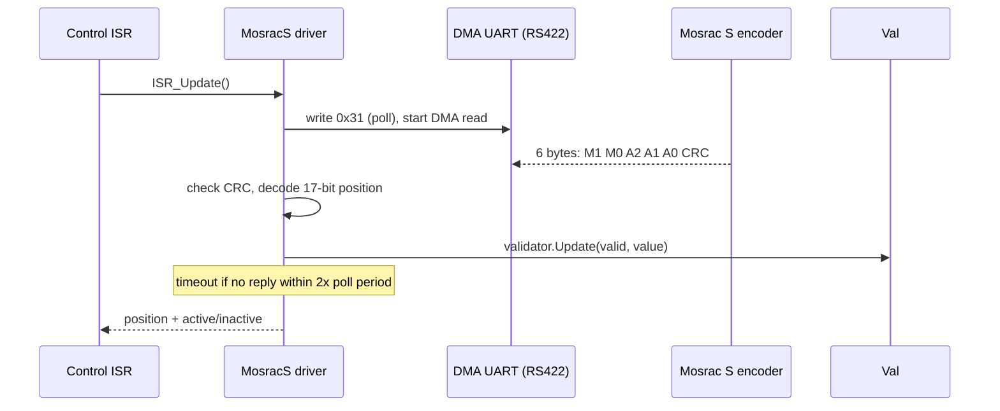

# archibald-moteus: Mosrac S encoder support for moteus

Real-time firmware support for the Mosrac S-series absolute magnetic encoder in the open-source [moteus](https://github.com/mjbots/moteus) brushless-servo controller (STM32G4). This fork adds an ISR-driven RS422/UART encoder driver and a robustness validator behind moteus's existing `aux_port` encoder abstraction.

This firmware was developed for Archibald Corporation. The encoder driver documented here lives in the moteus firmware tree under its Apache-2.0 license and is fully shareable. The Mosrac actuator design itself is proprietary and is not described here; this README covers only the open driver and integration contribution.

## What it is

[moteus](https://github.com/mjbots/moteus) is a widely used open-source brushless servo controller. It supports several encoders behind a common `aux_port` interface. This contribution adds a new one: the Mosrac S, a 17-bit absolute magnetic ring encoder, polled over RS422 UART.

My contribution ([commit `dce0392`](https://github.com/Archibald-Corp/archibald-moteus/commit/dce0392)) adds:

| File | Role |
|------|------|
| `fw/mosrac_s.h` | ISR-driven, DMA-backed RS422 driver: polls the encoder (command `0x31`), decodes the 6-byte response, handles timeouts and resync |
| `fw/mosrac_s_validator.h` | Startup and disconnect state machine that gates when the encoder is trusted |
| `fw/aux_port.h`, `fw/aux_common.h`, `fw/motor_position.h`, `fw/BUILD` | Wiring the new encoder into moteus's auxiliary-port and motor-position framework |

## Why I built it

The goal was to learn a production motor-control firmware from the inside rather than treat it as a black box. Bringing up a new sensor end to end, from datasheet to a real-time driver to trusted feedback into commutation, is a direct way to learn where the real constraints (timing, noise, framing, failure modes) live. Integrating behind moteus's existing abstractions, modeled on its AksIM-2 driver, kept the work portable and reviewable.

## How it works

The encoder runs inside the real-time control ISR, so it must be non-blocking. The driver is a small state machine over a DMA UART:



**Driver (`mosrac_s.h`).** On each ISR tick it either issues a new poll (only after `poll_rate_us` has elapsed) or services an outstanding DMA read. A reply that does not arrive within `2 * poll_rate_us` is treated as a timeout and resynced rather than blocking the loop. The code runs from CCM RAM (`MOTEUS_CCM_ATTRIBUTE`) to keep ISR latency low.

**Validator (`mosrac_s_validator.h`).** Raw readings are not trusted directly. The validator:

- requires `kStartupCount = 5` consecutive CRC-valid readings that agree within `kCpr/16` before transitioning from inactive to active, which rejects power-on garbage, and
- clears the active state when valid readings stop arriving, for example on a cable disconnect.

This prevents noise or an unplugged encoder from feeding bad position into commutation. The approach mirrors moteus's existing `Aksim2Validator` startup-consistency window.

## Key design decisions

- **Polling state machine in the ISR rather than a background task.** Keeping it in the control ISR guarantees fresh position every loop with deterministic latency, at the cost of strict non-blocking discipline, which the timeout and resync logic enforces.
- **Validator separate from decoder.** This keeps the wire protocol (`mosrac_s.h`) independent from the trust policy (`mosrac_s_validator.h`), so the consistency thresholds can be tuned without touching the driver.
- **Reuse of moteus conventions.** Following the AksIM-2 pattern made the change idiomatic within the upstream firmware rather than a bolt-on.

## Tech stack

- **MCU:** STM32G4
- **Language:** C++
- **Firmware:** moteus (Apache-2.0)
- **Interface:** RS422/UART with DMA
- **Encoder:** Mosrac S, 17-bit absolute (`kCpr = 131072`)
- **Build:** Bazel (moteus toolchain)

## Build

This builds as part of the moteus firmware. See the upstream [moteus docs](https://github.com/mjbots/moteus/blob/main/docs/) for the toolchain. In brief:

```bash
# from the repo root (Bazel-based moteus build)
tools/bazel build //fw:firmware
```
<!-- TODO: confirm the exact build/flash target and the Mosrac S aux-port config string, then replace the line above. -->

## Results and status

- Working ISR-driven RS422 driver and validator for the Mosrac S, integrated into moteus's `aux_port` encoder framework.
<!-- TODO: add any shareable bench results, for example poll rate achieved, measured position jitter, or disconnect-recovery behavior. Omit anything proprietary. -->

Questions about the broader (proprietary) actuator work: ethanmathias@gmail.com
