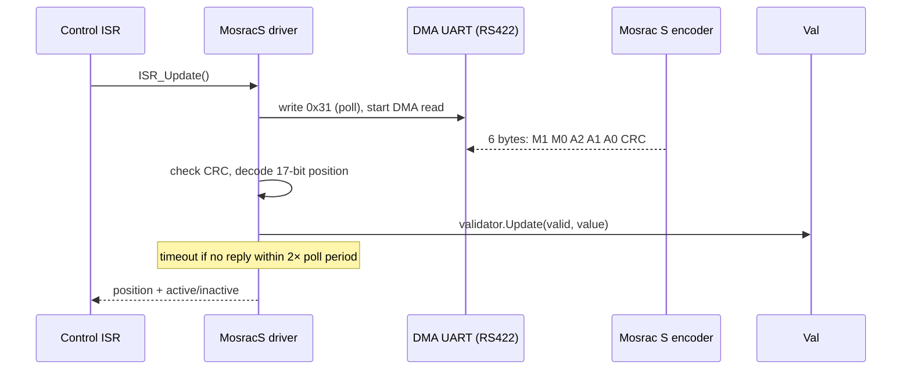

# archibald-moteus — Mosrac S encoder support for moteus

Real-time firmware support for the **Mosrac S-series absolute magnetic encoder** in the open-source [moteus](https://github.com/mjbots/moteus) brushless-servo controller (STM32G4). This fork adds an ISR-driven RS422/UART encoder driver and a robustness validator behind moteus's existing `aux_port` encoder abstraction.

> ⚠️ **Proprietary context.** This firmware was developed for **Archibald Corporation**. The encoder driver documented here lives in the moteus firmware tree under its **Apache-2.0** license and is fully shareable. The **Mosrac actuator design itself is proprietary** and is not described here — this README covers only the open driver/integration contribution.

## What it is

[moteus](https://github.com/mjbots/moteus) is a widely used open-source brushless servo controller. It supports several encoders behind a common `aux_port` interface. This contribution adds a new one: the **Mosrac S**, a 17-bit absolute magnetic ring encoder, polled over **RS422 UART**.

My contribution ([commit `dce0392`](https://github.com/Archibald-Corp/archibald-moteus/commit/dce0392)) adds:

| File | Role |
|------|------|
| `fw/mosrac_s.h` | ISR-driven, DMA-backed RS422 driver: polls the encoder (command `0x31`), decodes the 6-byte response, handles timeouts/resync |
| `fw/mosrac_s_validator.h` | Startup/disconnect state machine that gates when the encoder is trusted |
| `fw/aux_port.h`, `fw/aux_common.h`, `fw/motor_position.h`, `fw/BUILD` | Wiring the new encoder into moteus's auxiliary-port and motor-position framework |

## Why I built it

I wanted to learn a production motor-control firmware from the inside rather than treat it as a black box. Bringing up a new sensor end-to-end — datasheet → real-time driver → trusted feedback into commutation — is the fastest way to learn where the real constraints (timing, noise, framing, failure modes) actually live. Integrating behind moteus's existing abstractions (modeled on its AksIM-2 driver) kept the work portable and reviewable instead of a one-off hack.

## How it works

The encoder runs **inside the real-time control ISR**, so it must be non-blocking. The driver is a small state machine over a DMA UART:



**Driver (`mosrac_s.h`).** On each ISR tick it either issues a new poll (only after `poll_rate_us` has elapsed) or services an outstanding DMA read. A reply that doesn't arrive within `2 × poll_rate_us` is treated as a timeout and resynced rather than blocking the loop. The code runs from CCM RAM (`MOTEUS_CCM_ATTRIBUTE`) to keep ISR latency low.

**Validator (`mosrac_s_validator.h`).** Raw readings aren't trusted directly. The validator:
- requires **`kStartupCount = 5`** consecutive **CRC-valid** readings that agree within **`kCpr/16`** before transitioning *inactive → active* (rejects power-on garbage), and
- **clears active** when valid readings stop arriving (e.g. a cable disconnect),

so noise or an unplugged encoder can't feed bad position into commutation. The rationale mirrors moteus's existing `Aksim2Validator` startup-consistency window.

### Key design decisions / tradeoffs

- **Polling state machine in the ISR vs. a background task** — keeping it in the control ISR guarantees fresh position every loop with deterministic latency, at the cost of strict non-blocking discipline (hence the timeout/resync logic).
- **Separate validator from decoder** — keeps the wire protocol (`mosrac_s.h`) independent from the trust policy (`mosrac_s_validator.h`), so the consistency thresholds can be tuned without touching the driver.
- **Reuse moteus conventions** — following the AksIM-2 pattern made the change reviewable and idiomatic within the upstream firmware rather than a bolt-on.

## Tech stack

- **MCU:** STM32G4
- **Language:** C++
- **Firmware:** moteus (Apache-2.0)
- **Interface:** RS422 / UART with DMA
- **Encoder:** Mosrac S, 17-bit absolute (`kCpr = 131072`)
- **Build:** Bazel (moteus toolchain)

## Build

This builds as part of the moteus firmware. See upstream [moteus docs](https://github.com/mjbots/moteus/blob/main/docs/) for the toolchain. In brief:

```bash
# from the repo root (Bazel-based moteus build)
tools/bazel build //fw:firmware
```
<!-- TODO: confirm the exact build/flash target you used and the Mosrac S aux-port config string, then replace the line above. -->

## Results / status

- Working ISR-driven RS422 driver + validator for the Mosrac S, integrated into moteus's `aux_port` encoder framework.
- <!-- TODO: add any bench results you can share — e.g. poll rate achieved, measured position jitter, disconnect-recovery behavior, or the ~30% efficiency figure IF it belongs to shareable work (and name its baseline). Omit anything proprietary. -->

---
*Questions about the broader (proprietary) actuator work: ethanmathias@gmail.com*
