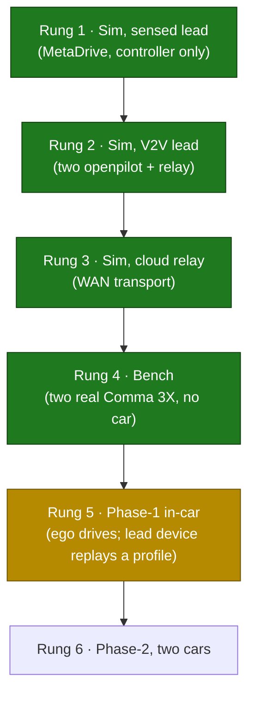

# openpilot-hcc — Cooperative cruise control, from simulation to a real car

**hCCC** (Human-in-the-loop **Cooperative Cruise Control**) running on **comma.ai openpilot** / a **Comma 3X**: a vehicle-to-vehicle (V2V) longitudinal controller that follows a lead car using the lead's *transmitted* speed and acceleration, validated up a six-rung ladder from MetaDrive simulation to an in-car field test. Built for UVA **Link Lab** cyber-physical-systems research.

> Active work lives on the **`hcc-ego`** branch (ego/main); the lead-device code is on `hcc-lead`. The whole-project narrative is in [`HCC_PROJECT_GUIDE.md`](https://github.com/ethanmathias/openpilot-hcc/blob/hcc-ego/HCC_PROJECT_GUIDE.md).

## What it is

Plain adaptive cruise control reacts only to the gap it can *see*. **hCCC is cooperative**: the lead vehicle broadcasts its speed and acceleration over the network, so the ego car reacts to what the lead is *doing* — which damps the stop-and-go waves a sensing-only controller amplifies in a platoon. The data path is identical in every environment:

```
lead publisher ──UDP──► relay ──UDP──► ego subscriber ──► hCCC ──► gas / brake   @ 50 Hz
```

It's built as a fork of [openpilot](https://github.com/commaai/openpilot) so the vehicle interfaces, safety model, and logging/replay tooling come for free and the work stays focused on the cooperative controller.

## Why I built it

Control algorithms that look safe in simulation often don't survive contact with real embedded timing, networks, and vehicle hardware. I wanted to find out *exactly where* that gap opens — so I didn't stop at a sim. I built the controller, the V2V transport, and the test tooling needed to walk the same code from a laptop all the way onto a moving car, and kept an honest record of what broke at each step.

## The controller

`selfdrive/controls/lib/hccc_controller.py` — a constant **time-headway** spacing controller (`t_h = 1.5 s`, gain `β = 0.65`) plus a **lead-lag feedforward compensator** on the lead's acceleration, tuned to match a BeamNG reference design:

```
a_cmd = β·(v_lead − v_ego) + F(s)·a_lead          F(s) = (τ·s + (1 − β·t̄ʰ)) / (t̄ʰ·s + 1)
```

The interesting decision: rather than pull in SciPy inside the real-time control process (`controlsd`), I **discretized `F(s)` in closed form with the bilinear (Tustin) transform** and run it as a 3-coefficient difference equation with scalar state — `y[n] = b0·x[n] + b1·x[n−1] − a1·y[n−1]`. Same response, no heavyweight dependency in the loop.

## Architecture & the testing ladder

The guiding principle: **find every defect in the cheapest, safest place it can be found.** Nothing advances a rung until the one below passes — and because the V2V plumbing (publisher, relay, subscriber) is *identical* at every rung, passing one rung is real evidence about the next.



Simulation uses **MetaDrive** behind a bridge that feeds openpilot synthetic camera/vehicle signals in the exact format a real car produces — so *the code under test is the unmodified production code*. Mode 1 follows the lead through the simulated sensor pipeline (isolates the controller); Mode 2 runs two openpilot instances over a local relay (the full V2V path), so a misbehaving run can be instantly re-run in Mode 1 to separate "controller problem" from "comms problem."

### Key design decisions / tradeoffs

- **UDP + a 100 ms staleness cutoff, not TCP.** For control data **late is worse than lost**: TCP's retransmit blocks newer packets behind a stale one. With UDP a dropped packet is simply superseded 20 ms later, and if *nothing* arrives for 100 ms the subscriber marks the signal stale and hCCC stops commanding — the response to silence is always "do less," never extrapolate.
- **A relay in the middle, not direct lead→ego.** One auditable point that logs every packet, one address to reconfigure when moving between laptop / car / cloud, and it matches the eventual cellular architecture (two cars can't address each other directly, but both can reach a server).
- **HIL was investigated and deliberately abandoned** — for a *hardware* reason, not a software one: the Comma 3X's USB-C port is wired to its internal safety MCU (the "panda"), not its main computer, so the PC↔device link HIL needs can't exist. The bench test was built as its replacement and caught everything HIL was meant to.

## Engineering for the field

The real-world tooling (`tools/real_world_testing/`) encodes lessons from bring-up:

- **A 14-item preflight gate** refuses to start a run until both devices are reachable, the relay is up, every config flag is right, and — subtly — the two devices' **clocks agree** (the lead has no internet on the test network to sync from, and a >500 ms skew makes the subscriber silently reject every packet).
- **Runs survive a dropped laptop link** (device-side programs launch disconnect-proof; one `collect` command recovers the data) and land in **one immutable, timestamped folder** per run.
- **Layered safety:** `abort` kills the data feed (staleness stops hCCC within 100 ms), but it is *not* the emergency stop — the driver's brake is, via openpilot's normal instant disengagement. The tooling never engages or disengages the car.

## Testing

~29 unit tests across the controller, V2V core, and tooling (`test_hccc_controller.py`, `test_hcc_v2v.py`, `test_virtual_lead.py`, `test_launcher_common.py`, `test_field_test.py`), on top of the simulation and bench rungs above.

## Results

**Bench (2026-06-12, no vehicle):** went from "set up" to "validated" in one day and surfaced three real defects — including a type-mismatch crash in code that *also* runs inside the vehicle control process (would have shut down the controller mid-drive). Final transport: **1750 / 1750 packets delivered at 50 Hz, 0% loss, worst inter-arrival gap 51 ms** against the 100 ms limit.

**In-car (2023 Kia Sportage, 2026-06-14):** first on-vehicle run of the full loop.
- ✅ **V2V transport in the car: 2000 / 2000 packets, 0% loss at 50 Hz, ~20 ms median inter-arrival** — identical to the bench.
- ✅ **hCCC engaged on real hardware and produced smooth, correctly-signed acceleration commands** (e.g. ramping −0.1 → −2.0 m/s² tracking the lead); the lead-lag feedforward ran stably.
- ❌ The full drive was blocked by a **vehicle hardware limitation, not a software flaw**: this base-trim Sportage lacks the Smart Cruise Control package openpilot needs to inject acceleration, so the commands had nowhere to go (isolated cleanly with joystick mode, which bypasses hCCC entirely). The HC3 stack is fully car-agnostic — the fix is a **car swap to a radar-SCC vehicle**, no code changes.

**Status:** rungs 1–4 pass; phase-1 in-car validated everything except the final actuation link; next is a radar-SCC car, then phase-2 (two vehicles — the lead-side publisher already exists on `hcc-lead`).

## Tech stack

- **Language:** Python
- **Platform:** comma.ai openpilot on Comma 3X (AGNOS)
- **Simulation:** MetaDrive (controller originally tuned against a BeamNG reference)
- **Transport:** UDP V2V with relay, 50 Hz, 100 ms staleness rule
- **Domain:** cooperative longitudinal control / CACC, cyber-physical systems (UVA Link Lab)

## Build / run

This is an openpilot fork; full-stack setup follows [upstream openpilot](https://github.com/commaai/openpilot). Quick paths:

```bash
# Simulation (Mode 1: controller vs. a sensed lead in MetaDrive)
tools/sim/launch_openpilot_ego.sh          # see tools/sim/README.md for Mode 2 (V2V)

# Bench / field V2V check on real devices
tools/hcc_v2v/scripts/setup_v2v_network.sh # one-time per device
python tools/real_world_testing/field_test.py check   # 14-point preflight
python tools/real_world_testing/field_test.py run --scenario 48
```

See [`HCC_PROJECT_GUIDE.md`](https://github.com/ethanmathias/openpilot-hcc/blob/hcc-ego/HCC_PROJECT_GUIDE.md), `tools/real_world_testing/README.md`, and `tools/sim/README.md` for the full procedures.

---
📫 ethanmathias@gmail.com
