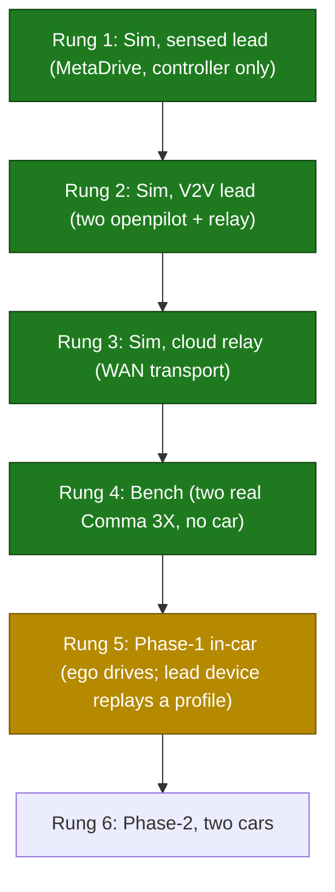

# openpilot-hcc: Cooperative cruise control, from simulation to a real car

hCCC (Human-in-the-loop Cooperative Cruise Control) running on comma.ai openpilot and a Comma 3X: a vehicle-to-vehicle (V2V) longitudinal controller that follows a lead car using the lead's transmitted speed and acceleration, validated up a six-rung ladder from MetaDrive simulation to an in-car field test. Built for UVA Link Lab cyber-physical-systems research.

Active work lives on the `hcc-ego` branch (ego/main); the lead-device code is on `hcc-lead`. The full project narrative is in [`HCC_PROJECT_GUIDE.md`](https://github.com/ethanmathias/openpilot-hcc/blob/hcc-ego/HCC_PROJECT_GUIDE.md).

## What it is

Plain adaptive cruise control reacts only to the gap it can sense. hCCC is cooperative: the lead vehicle broadcasts its speed and acceleration over the network, so the ego car reacts to what the lead is doing, which damps the stop-and-go waves a sensing-only controller amplifies in a platoon. The data path is identical in every environment:

```
lead publisher --UDP--> relay --UDP--> ego subscriber --> hCCC --> gas/brake   (50 Hz)
```

It is built as a fork of [openpilot](https://github.com/commaai/openpilot) so the vehicle interfaces, safety model, and logging and replay tooling are provided, and the work stays focused on the cooperative controller.

## Why I built it

Control algorithms that look safe in simulation often do not survive contact with real embedded timing, networks, and vehicle hardware. The goal was to find exactly where that gap opens, which meant going past simulation. I built the controller, the V2V transport, and the test tooling needed to walk the same code from a laptop onto a moving car, and kept a record of what broke at each step.

## The controller

`selfdrive/controls/lib/hccc_controller.py` is a constant time-headway spacing controller (`t_h = 1.5 s`, gain `beta = 0.65`) plus a lead-lag feedforward compensator on the lead's acceleration, tuned to match a BeamNG reference design:

```
a_cmd = beta*(v_lead - v_ego) + F(s)*a_lead
F(s)  = (tau*s + (1 - beta*th_bar)) / (th_bar*s + 1)
```

Rather than pull in SciPy inside the real-time control process (`controlsd`), I discretized `F(s)` in closed form with the bilinear (Tustin) transform and run it as a three-coefficient difference equation with scalar state: `y[n] = b0*x[n] + b1*x[n-1] - a1*y[n-1]`. Same response, no heavyweight dependency in the loop.

## Architecture and the testing ladder

The guiding principle is to find every defect in the cheapest, safest place it can be found. Nothing advances a rung until the one below passes, and because the V2V plumbing (publisher, relay, subscriber) is identical at every rung, passing one rung is evidence about the next.



Simulation uses MetaDrive behind a bridge that feeds openpilot synthetic camera and vehicle signals in the exact format a real car produces, so the code under test is the unmodified production code. Mode 1 follows the lead through the simulated sensor pipeline, which isolates the controller. Mode 2 runs two openpilot instances over a local relay, which is the full V2V path, so a misbehaving run can be re-run in Mode 1 to separate a controller problem from a communication problem.

## Key design decisions

- **UDP with a 100 ms staleness cutoff, not TCP.** For control data, late is worse than lost: TCP's retransmit blocks newer packets behind a stale one. With UDP a dropped packet is superseded 20 ms later, and if nothing arrives for 100 ms the subscriber marks the signal stale and hCCC stops commanding. The response to silence is always to do less, never to extrapolate.
- **A relay in the middle, not direct lead-to-ego.** This gives one auditable point that logs every packet, one address to reconfigure when moving between laptop, car, and cloud, and it matches the eventual cellular architecture in which two cars cannot address each other directly but both can reach a server.
- **HIL was investigated and deliberately abandoned**, for a hardware reason rather than a software one: the Comma 3X's USB-C port is wired to its internal safety MCU (the panda), not its main computer, so the PC-to-device link HIL needs cannot exist. The bench test replaced it and caught everything HIL was meant to.

## Engineering for the field

The real-world tooling (`tools/real_world_testing/`) encodes lessons from bring-up:

- **A 14-item preflight gate** refuses to start a run until both devices are reachable, the relay is up, every config flag is correct, and the two devices' clocks agree. The lead has no internet on the test network to sync from, and a skew over 500 ms makes the subscriber silently reject every packet.
- **Runs survive a dropped laptop link.** Device-side programs launch in a disconnect-proof way, and one `collect` command recovers the data afterward. Each run lands in one immutable, timestamped folder.
- **Layered safety.** `abort` kills the data feed, and staleness stops hCCC within 100 ms, but it is not the emergency stop. The driver's brake is, via openpilot's normal instant disengagement. The tooling never engages or disengages the car.

## Testing

About 29 unit tests cover the controller, V2V core, and tooling (`test_hccc_controller.py`, `test_hcc_v2v.py`, `test_virtual_lead.py`, `test_launcher_common.py`, `test_field_test.py`), on top of the simulation and bench rungs above.

## Results

**Bench (2026-06-12, no vehicle).** Went from set up to validated in one day and surfaced three real defects, including a type-mismatch crash in code that also runs inside the vehicle control process, which would have shut down the controller mid-drive. Final transport: 1750 of 1750 packets delivered at 50 Hz, 0% loss, worst inter-arrival gap 51 ms against the 100 ms limit.

**In-car (2023 Kia Sportage, 2026-06-14).** First on-vehicle run of the full loop.

- V2V transport in the car: 2000 of 2000 packets, 0% loss at 50 Hz, about 20 ms median inter-arrival, matching the bench.
- hCCC engaged on real hardware and produced smooth, correctly-signed acceleration commands, for example ramping from -0.1 to -2.0 m/s^2 tracking the lead. The lead-lag feedforward ran stably.
- The full drive was blocked by a vehicle hardware limitation, not a software flaw: this base-trim Sportage lacks the Smart Cruise Control package openpilot needs to inject acceleration, so the commands had nowhere to go. This was isolated with joystick mode, which bypasses hCCC entirely. The stack is fully car-agnostic, so the fix is a car swap to a radar-SCC vehicle with no code changes.

**Status:** rungs 1 through 4 pass; the phase-1 in-car test validated everything except the final actuation link; next is a radar-SCC car, then phase-2 with two vehicles (the lead-side publisher already exists on `hcc-lead`).

## Tech stack

- **Language:** Python
- **Platform:** comma.ai openpilot on Comma 3X (AGNOS)
- **Simulation:** MetaDrive (controller originally tuned against a BeamNG reference)
- **Transport:** UDP V2V with relay, 50 Hz, 100 ms staleness rule
- **Domain:** cooperative longitudinal control (CACC), cyber-physical systems (UVA Link Lab)

## Build and run

This is an openpilot fork; full-stack setup follows [upstream openpilot](https://github.com/commaai/openpilot). Quick paths:

```bash
# Simulation (Mode 1: controller against a sensed lead in MetaDrive)
tools/sim/launch_openpilot_ego.sh          # see tools/sim/README.md for Mode 2 (V2V)

# Bench or field V2V check on real devices
tools/hcc_v2v/scripts/setup_v2v_network.sh # one-time per device
python tools/real_world_testing/field_test.py check   # 14-point preflight
python tools/real_world_testing/field_test.py run --scenario 48
```

See [`HCC_PROJECT_GUIDE.md`](https://github.com/ethanmathias/openpilot-hcc/blob/hcc-ego/HCC_PROJECT_GUIDE.md), `tools/real_world_testing/README.md`, and `tools/sim/README.md` for the full procedures.

Contact: ethanmathias@gmail.com
