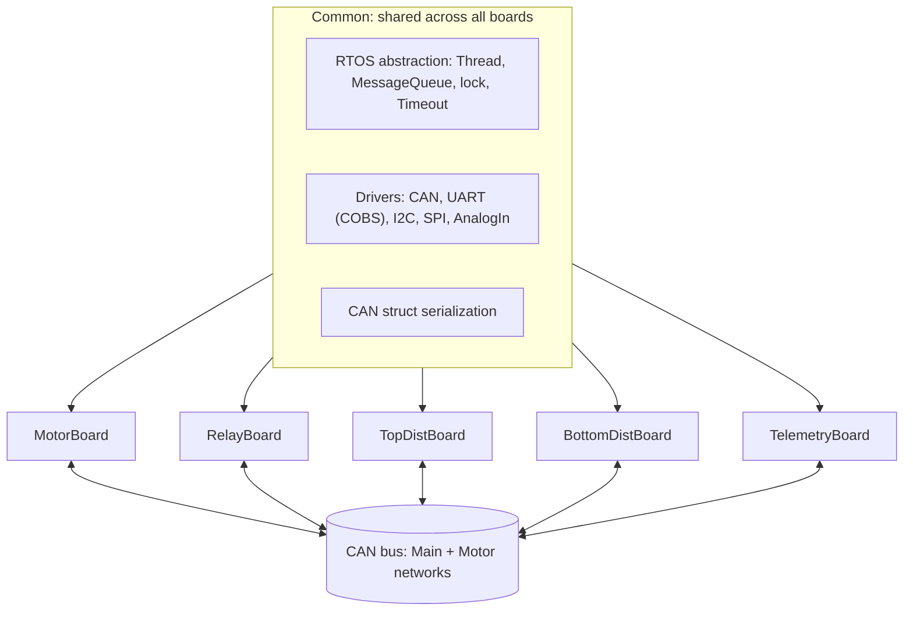

# solarcar-Rivanna3S: UVA Solar Car embedded firmware

Embedded firmware for UVA Solar Car's Rivanna3S platform: five STM32G4 boards that coordinate over CAN, running shared C++ drivers on top of a custom FreeRTOS abstraction layer.

Upstream: [solarcaratuva/Rivanna3S](https://github.com/solarcaratuva/Rivanna3S). This README documents the architecture and my work on the shared driver and RTOS layer.

## What it is

Rivanna3S is a distributed embedded system. Each subsystem runs on its own STM32G474 board and communicates with the others over a shared CAN bus:

| Board | Responsibility |
|-------|----------------|
| `MotorBoard` | Throttle and regen, motor-controller interface, cruise control |
| `RelayBoard` | Contactor and relay control |
| `TopDistBoard`, `BottomDistBoard` | Power distribution |
| `TelemetryBoard` | Logging and off-vehicle telemetry |

All five share a common library: drivers (`CAN`, `UART`, `I2C`, `SPI`, `AnalogIn`/`ScaledAnalogIn`, `DigitalIn`/`DigitalOut`), CAN message serialization and deserialization, and a FreeRTOS abstraction layer (`Thread`, `MessageQueue`, `lock`, `Timeout`, `Clock`).

## Why I built it

I wanted to own the OS layer, not treat FreeRTOS as a black box. Wrapping the raw RTOS calls in C++ types (`Thread::start()`, message queues, RAII locks) forces you to be explicit about priorities, shared peripherals, and timing budget, and it lets each board's code read as plain concurrent tasks instead of FreeRTOS boilerplate. On a vehicle where any board can stall the shared bus, that discipline matters.

## Architecture



Each board's `main.cpp` instantiates drivers and `Thread`s, registers CAN message handlers, and starts the scheduler. Two logical CAN networks (`Main` and `Motor`) are separated at the `CanInterface` level. Host logging uses COBS-framed UART (`UartCobs`, `Cobs`) so log frames stay recoverable on a noisy line.

## Key design decisions

- **One shared driver and RTOS layer across five different boards.** Coherent and testable, at the cost of each board carrying some abstraction it doesn't strictly need. The tradeoff favors maintainability on a student team with rotating membership.
- **Thin C++ wrappers over FreeRTOS, not a from-scratch scheduler.** Keep FreeRTOS's proven scheduler; add typed concurrency primitives on top.
- **COBS framing on UART logging.** A couple of bytes per frame buys unambiguous packet boundaries, so a glitch doesn't desync the whole log stream.

## Tech stack

- **MCU:** STM32G474RET6 (Cortex-M4)
- **Languages:** C++ (firmware), Python (build and flash tooling)
- **RTOS:** FreeRTOS, behind a custom C++ abstraction layer
- **Interfaces:** CAN (Main and Motor networks), UART (COBS), I2C, SPI, analog
- **Build:** CMake, Ninja, `arm-gcc`, containerized with Docker
- **Flash:** STM32CubeProgrammer CLI over SWD
- **Bench validation:** Analog Discovery (signal-integrity and bus verification)

## Build and run

The build runs in a Docker container so the toolchain is reproducible:

```bash
# first-time setup: create the compile container
python compile.py --install

# compile all boards (default MCU: STM32G474RET6)
python compile.py

# flash a specific board over SWD (for example the motor board)
python upload.py motor      # boards: motor, relay, topdist, bottomdist, telemetry

# monitor logs over UART
python monitor.py
```

See the team wiki ([solarcaratuva.github.io](https://solarcaratuva.github.io/)) for the full compile, upload, and monitor guide.

## Validation

- Verified bus signal integrity on real hardware with an Analog Discovery rather than assuming clean CAN and UART lines.
- A separate [CAN Message Logger](https://github.com/solarcaratuva/CANMessageLogger) tool is used for bus-level logging, debugging, and analysis.

<!-- TODO: add specifics if you want them: CAN bitrate (MotorBoard configures 250 kbps), measured timing/jitter, ringing or termination findings from the Analog Discovery captures, and which boards you personally brought up. -->

## Results and status

<!-- TODO: confirm deployment status, for example boards running on the vehicle, race or event participation, and number of concurrent tasks per board. State only what you can back up. -->

Contact: ethanmathias@gmail.com
